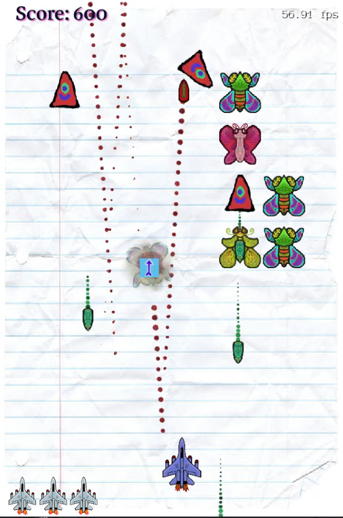
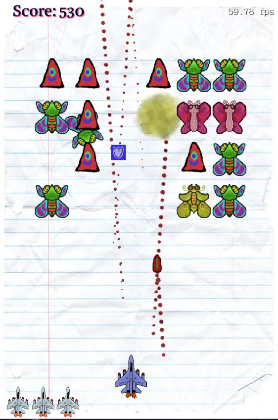
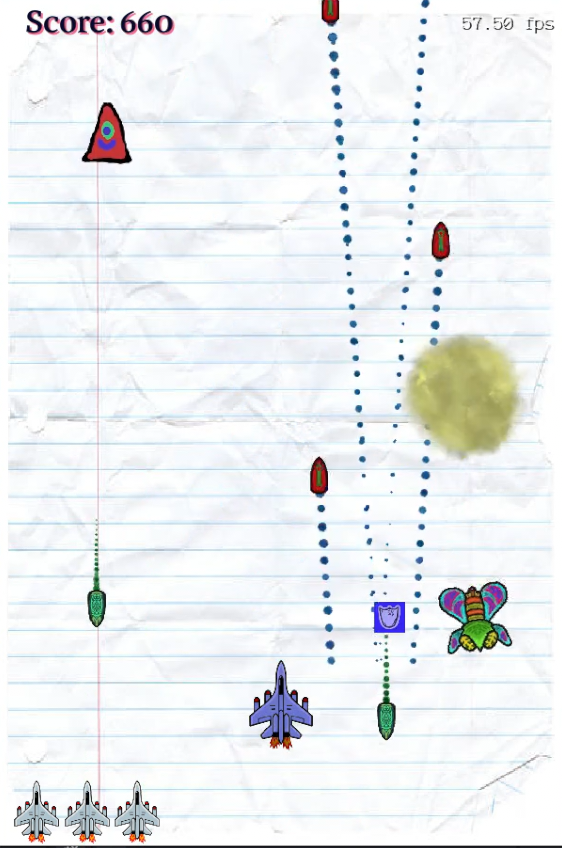
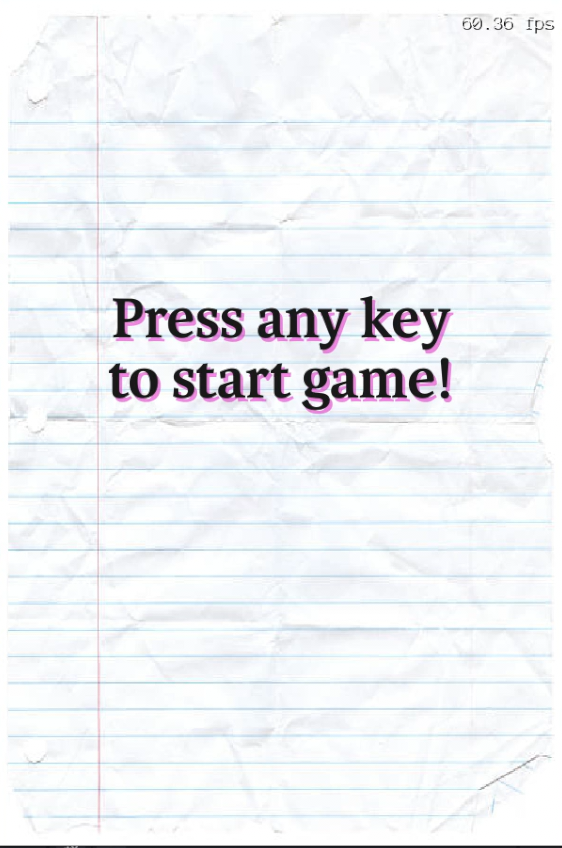
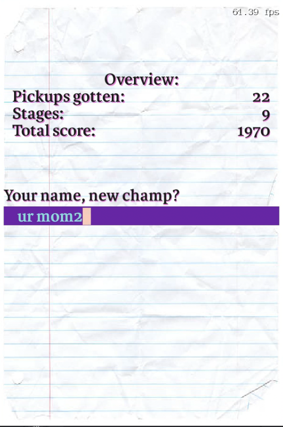
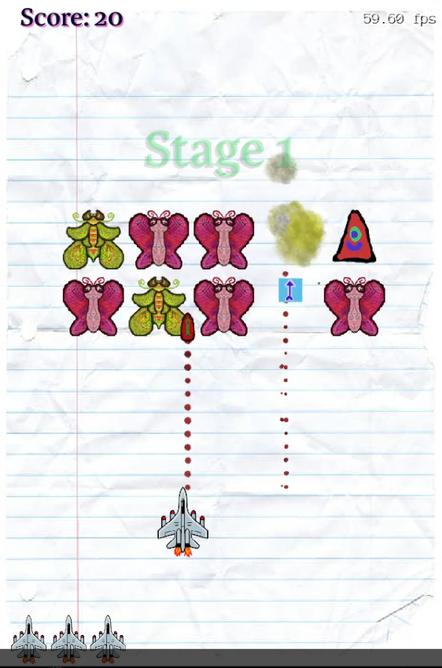
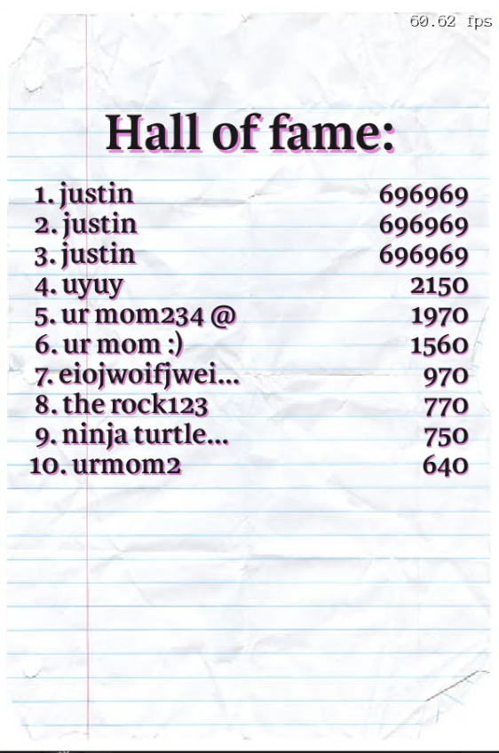
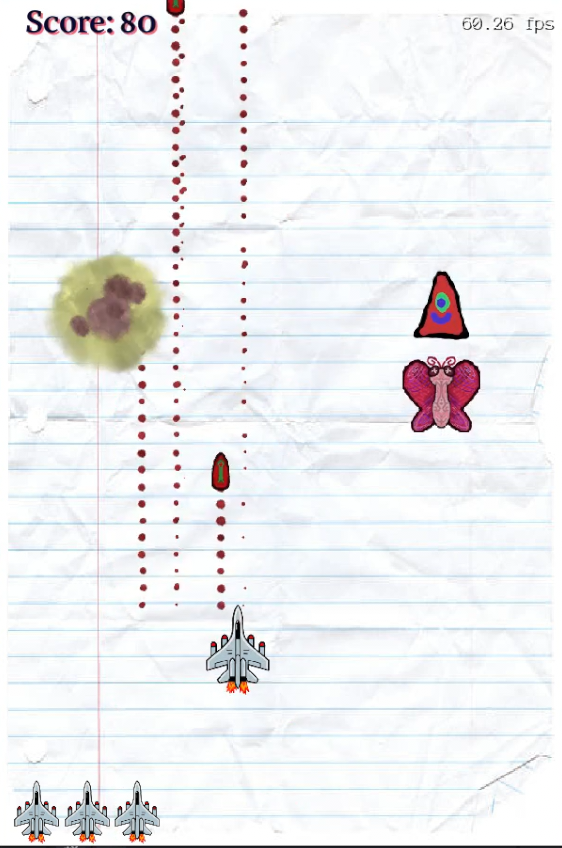

# Galaga, Invaders clone

This game is a graphics demo using the 2D functionalities of the engine from the [block-pusing game](https://github.com/salaadas/block_pushing_game). It was written in and tested extensively on a Ubuntu 24.04 LTS machine, although Windows support is not too hard given our minimal dependencies on Linux headers.

It was also our competition entry for HackHarvard 2024 and we ended up winning a small prize from MATLAB!

{:height="50%" width="50%"}

Some notable features that I implemented in this game was:

- Custom mixer and audio player using miniaudio. (One bug right now is that the audio is glitchy if you Alt-Tab or sleep the laptop).
- Immediate UI graphics and widgets.
- Uses catalog assets and hot reloading as well as assets packaging.
- Different behaviours for enemies, allows for enemy waves.
- Enemies has rage threshold and theire movements is based on how aggressive the player is.
- Has multiple power ups for the player (V shots, double/triple shots, piercing shots, freezing shots, immunity, ...).

Some more screenshots:

